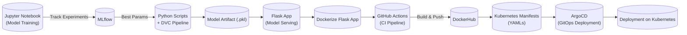

# End-to-End MLOps Project: Continuous Integration and Continuous Delivery with Github Action and Continuous Deployment with ArgoCD

This project demonstrates a **complete MLOps pipeline** for comment sentiment analysis application.

The ML model predicts sentiment (positive/negative/neutral) for user comments. The workflow covers every stage of the lifecycle:

1. **Model Training** → Using **Jupyter Notebooks** & **MLflow** for experiment tracking.
2. **Parameter Selection** → Best hyperparameters logged and chosen.
3. **Pipeline Automation** → **DVC pipeline** created using Python scripts.
4. **Model Serving** → Flask app wraps the trained model as a REST API.
5. **Containerization** → Dockerfile builds model serving image.
6. **Continuous Integration (CI)** → GitHub Actions builds, tests, and pushes the image to **DockerHub**.
7. **Continuous Deployment (CD)** → ArgoCD deploys the application on a Kubernetes cluster.

This project simulates a **real-world, production-style MLOps setup**.

---

## High Level Diagram of the MLOps Pipeline



---

## Project Structure

```
├── data/                                       # Sample datasets
├── notebooks/                                  # Jupyter notebooks for exploration & training
│   └── 01_Preprocessing_and_EDA.ipynb
│   └── 02_Baseline_Model.ipynb
│   └── 03_BoW_and_TF-IDF.ipynb
│   └── 04_TF-IDF_max_features.ipynb
│   └── 05_Handling_Imbalanced_Data.ipynb
│   └── 06_xgboost_with_HPT.ipynb
│   └── 07_LightGBM_HP_Tuning.ipynb
│   └── 08_Stacking.ipynb
│
├── src/                                        # Python scripts for DVC pipeline
│   ├── data/
│   │   ├── data_ingestion.py
│   │   └── data_preprocessing.py
│   │
│   ├── model/
│   │   ├── model_building.py
│   │   ├── model_evaluation.py
│   │   └── register_model.py
│   │
│   └── __init__.py
│
├── dvc.yaml                                    # DVC pipeline definition
│
├── app.py                                      # Flask app for model serving
├── requirements.txt
│
├── Dockerfile                                  # Dockerfile for serving app
├── k8s-manifests/                              # Kubernetes manifests
│   ├── deployment.yaml
│   └── service.yaml
│
├── .github/workflows/ci.yaml                   # GitHub Actions workflow
├── README.md                                   # Project documentation
```

### 1. Jupyter Notebook (Model Training)

The initial training and experimentation is done in **`notebooks/sentiment_analysis.ipynb`**:

* Load dataset (comments + labels).
* Preprocess text (tokenization, stopword removal, embeddings).
* Train models (Logistic Regression, LSTM, etc.).
* Log experiments and metrics to **MLflow**.
* Select best hyperparameters.

#### Running MLflow

We use **MLflow** for experiment tracking (parameters, metrics, and models).
To start the MLflow UI locally:

```bash
# Install MLflow
pip install mlflow

# Run MLflow UI
mlflow ui --backend-store-uri sqlite:///mlflow.db --host 0.0.0.0 --port 5000
```

Now open your browser at `http://127.0.0.1:5000`

From here, you can:

* Compare experiments and parameters
* Visualize metrics over time
* Track best models for deployment

### 2. Python Code (DVC Pipeline)

Once the best parameters are chosen, they are converted into Python scripts managed by **DVC**:

* `src/data/` → preprocess dataset.
* `src/model/` → train model with chosen parameters and evaluate performance and save metrics.

The **DVC pipeline** is defined in `dvc.yaml`

### 3. Flask App (Model Serving)

The trained model is wrapped with a **Flask API** (`app.py`):

* Loads a pre-trained ML model + TF-IDF vectorizer.
* Provides endpoints for sentiment prediction (`/predict`, `/predict_with_timestamps`).
* Generates visualizations: pie charts, word clouds, and sentiment trend graphs.
* Uses preprocessing (stopword removal, lemmatization) for cleaner inputs.

### 4. Dockerfile

Containerize the Flask app:

* Installs system dependencies (`libgomp1`, `build-essential`, `gcc`).
* Installs Python dependencies from `requirements.txt`.
* Copies the Flask app and models into `/app`.
* Exposes port **8080** and runs the app with `python3 app.py`.

### 5. CI with GitHub Actions

The **CI pipeline** (`.github/workflows/mlops_pipeline.yaml`), this workflow automates **integration and delivery** for the project:

* **Trigger:** Runs on pushes to `main` when `src/**/*.py`, `params.yaml`, `app.py`, or `Dockerfile` change.

* **Continuous Integration (CI):**
  * Sets up Python and installs dependencies.
  * Starts the Flask app and performs a health check (`curl` to `/`).

* **Continuous Delivery (CD):**
  * Logs into DockerHub using secrets.
  * Builds and pushes the Docker image:
    `docker.io/<DOCKERHUB_USERNAME_TAG>/comment-sentiment-analysis:latest`

### 6. Kubernetes Manifests

The `k8s-manifests/` directory contains the YAML files required to deploy the service on Kubernetes:

* **`deployment.yaml`** → Defines a `Deployment` with multiple replicas of the Flask app container (ensures scalability and fault tolerance).
* **`service.yaml`** → Exposes the app inside the cluster via a `Service` (type `NodePort`), allowing other services or external users to access it.

### 7. ArgoCD Deployment

**ArgoCD:**
* Ensures **automated deployment** of the latest container image built & pushed via GitHub Actions.
* Provides a **self-healing mechanism**: if the live state drifts from Git, Argo CD will reconcile it back.
* Offers a **UI and CLI** for visualizing, managing, and rolling back deployments.

The project uses **Argo CD** for GitOps-based continuous deployment:

#### Install ArgoCD in Kubernetes

```bash
# Create namespace for argocd
kubectl create namespace argocd

# Install argocd
kubectl apply -n argocd -f https://raw.githubusercontent.com/argoproj/argo-cd/stable/manifests/install.yaml

# Accessing argocd ui via port-forwarding
kubectl -n argocd port-forward svc/argocd-server 8080:443

# Login credentials:
URL: `http://localhost:8080`
Username: `admin`
Password: `kubectl -n argocd get secret argocd-initial-admin-secret -o jsonpath="{.data.password}" | base64 -d`

# Installing argocd cli
VERSION=$(curl -L -s https://raw.githubusercontent.com/argoproj/argo-cd/stable/VERSION)
curl -sSL -o argocd-linux-amd64 https://github.com/argoproj/argo-cd/releases/download/v$VERSION/argocd-linux-amd64
sudo install -m 555 argocd-linux-amd64 /usr/local/bin/argocd
rm argocd-linux-amd64

# Access argocd via cli
ARGOCD_PASSWORD=$(kubectl -n argocd get secret argocd-initial-admin-secret -o jsonpath="{.data.password}" | base64 -d)

# login
argocd login localhost:8080 \
  --username admin \
  --password $ARGOCD_PASSWORD \
  --insecure

# list apps
argocd app list

# list repos
argocd repo list
```

#### Add Github Repo to ArgoCD

```bash
argocd repo add <your-github-repo-url> \
  --username <github-username> \
  --password <github-token>
```

> `<github-token>` is your GitHub **Personal Access Token (PAT)**.
> Ensure it has at least **repo scope** if your repository is private.

#### ArgoCD Application

Defines an Argo CD `Application` that continuously syncs Kubernetes manifests from this GitHub repo to the target cluster namespace.

```bash
argocd app create comment-sentiment-analysis \
  --repo <your-github-repo-url> \
  --path k8s-manifest \
  --dest-server https://kubernetes.default.svc \
  --dest-namespace default
```

#### Sync the Application

```bash
argocd app sync comment-sentiment-analysis
```

This setup completes the MLOps pipeline by bridging **CI (GitHub Actions)** with **CD (Argo CD)**, ensuring the ML service is always up-to-date in Kubernetes.
---

#### Acknowledgements

This project was inspired by and built upon concepts learned from the excellent free resources provided by [FreeCodeCamp](https://www.freecodecamp.org/).

Their free courses on **MLOps Pipeline with Python, AWS, Docker** helped shape the foundation of this end-to-end project.
